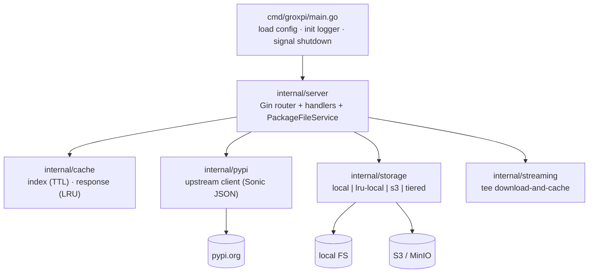
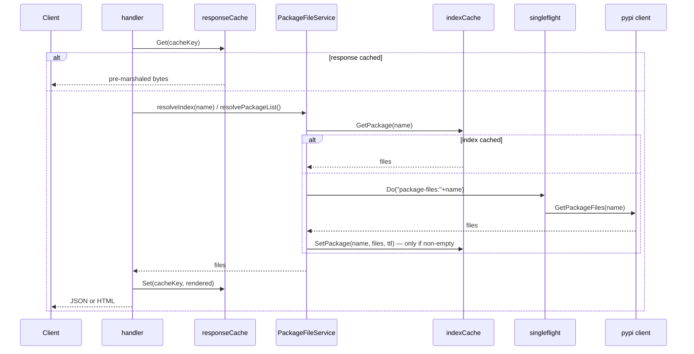
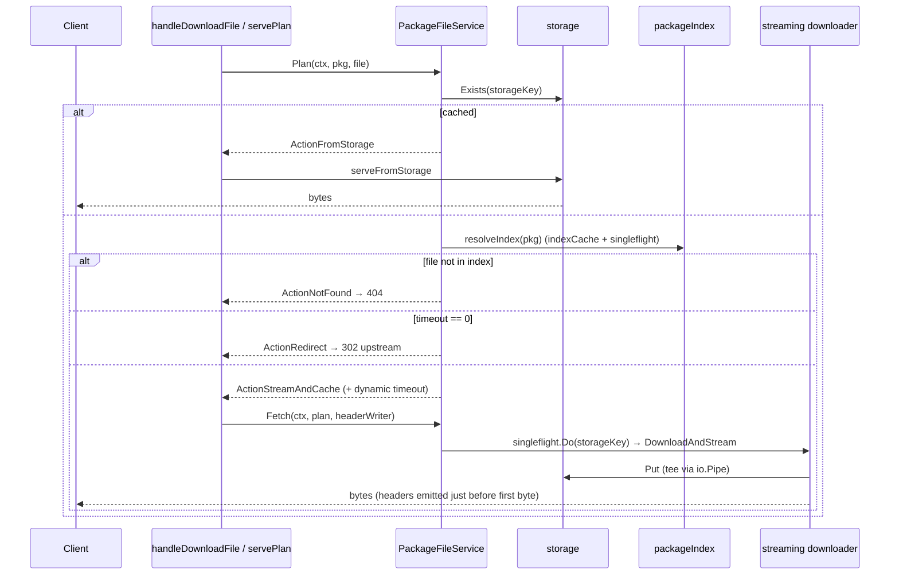
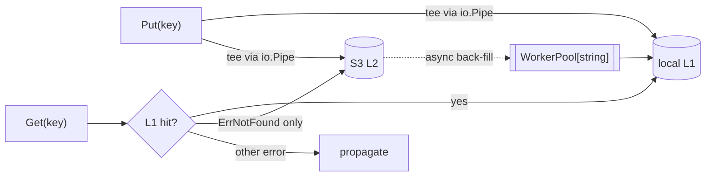

# groxpi Architecture

Firm reference for the current design: what the modules are, how a request flows through them, where the seams sit, and where the remaining friction lives. Improvement work is tracked separately in [`tasks/architecture-improvement-plan.md`](../tasks/architecture-improvement-plan.md).

*Describes the tree at commit `ba2e0d6` (2026-07-26), after the A–E architecture refactor and the three follow-up fixes (`97282f1`, `1fde004`, `ba2e0d6`).*

Vocabulary follows the `/codebase-design` glossary — **module** (interface + implementation), **interface** (everything a caller must know), **seam** (where behaviour can be swapped), **adapter** (a thing satisfying an interface at a seam), **depth** (behaviour per unit of interface), **leverage**, **locality**.

## 1. Top-level shape

groxpi is a single Go binary: a Gin HTTP server that proxies and caches the PyPI Simple API (PEP 503/691). Every request is served by handlers that orchestrate four internal modules — `cache`, `pypi`, `storage`, `streaming` — behind an in-memory cache plus an on-disk (and optionally S3) object store.

**Bootstrap** (`cmd/groxpi/main.go`): `config.Load()` → `logger.Init()` → `server.New(cfg)` → `http.Server.ListenAndServe`, with a 5s graceful shutdown on SIGINT/SIGTERM.

**Wiring** (`server.New`, `server.go`): builds the two in-memory caches, the pypi client, the storage backend (`initStorage` picks `local` / `s3` / `hybrid` from `cfg.StorageType`), the tee streaming downloader, and the `PackageFileService`, then registers routes. All dependencies are constructed inside `New` and held on the `Server` struct — see [§5 remaining friction](#5-remaining-friction) for the testability cost.

**Routing** (`setupRoutes`): `router.HandleMethodNotAllowed = true`, so a known path reached with an unregistered method is answered by gin with `405` plus an `Allow` header instead of falling through to the `NoRoute` 404 handler. `POST /simple/` and `GET /cache/list` are both 405. Only `GET` is registered on the index and download routes, so `HEAD` on them is also 405 — see [§5 remaining friction](#5-remaining-friction).

## 2. Module map

| Module | Files | Role | Depth |
|---|---|---|---|
| `config` | `config.go` | env-var config load, proxpi-compatible | shallow (data) |
| `logger` | `logger.go` | slog setup: stdout handler fanned out to the OpenTelemetry log bridge | shallow (data) |
| `telemetry` | `telemetry.go` | OTel trace/metric/log provider setup over OTLP; no-op with no endpoint | shallow (data) |
| `cache` | `index.go`, `response.go` | 2 in-memory caches: TTL map for parsed indexes, LRU for pre-marshaled JSON | shallow–moderate |
| `pypi` | `client.go` | upstream Simple API client; Sonic JSON parse, PEP 503 HTML fallback | moderate |
| `storage` | `storage.go`, `local.go`, `lru.go`, `s3.go`, `tiered.go`, `workerpool.go` | pluggable object storage; L1/L2 tiering; generic bounded worker pool | deep |
| `streaming` | `interfaces.go`, `downloader.go` | one seam: download while teeing into storage | one deep seam |
| `server` | `server.go`, `packagefile.go` | Gin transport (`server.go`) + package-file decision pipeline (`packagefile.go`) | moderate |

## 3. Seams

Real seams (behaviour genuinely swaps across them):

- **`storage.Storage`** (`storage.go`) — 7 methods (`Get`/`Put`/`Stat`/`Delete`/`Exists`/`List`/`Close`). Adapters: `LocalStorage`, `LRULocalStorage`, `S3Storage`, `TieredStorage`; selected by config. *This is the load-bearing seam of the app.*
- **`storage.ZeroCopyCapable`** — an opt-in capability interface. A backend implements it only when it can honour it for real: `LocalStorage`/`LRULocalStorage`/`TieredStorage` implement `GetFilePath`; `S3Storage` does not, because it has no local path to name. Callers discover it by type assertion, never by asking which backend they hold. A sibling `Presignable` interface existed until it was deleted for having no production caller — see [§5 remaining friction](#5-remaining-friction).
- **`streaming.StreamingDownloader`** (`interfaces.go`) — one method, `DownloadAndStream`; production wires `NewTeeStreamingDownloader`.
- **`streaming.StorageWriter`** (`downloader.go`) — narrow write-only view of storage: one method whose signature is `storage.Storage.Put` verbatim, so every backend satisfies it directly and `NewTeeStreamingDownloader` is handed the storage backend itself. `streaming` imports `storage` for `*storage.ObjectInfo`; the adapter that used to sit between them existed to avoid an import cycle that was never there, and was deleted in `1fde004`.

Internal seams used for composition and testing:

- **`storage.l1Storage`** (`tiered.go`) — the L1 tier contract (`Storage` + `ZeroCopyCapable`). Lets `newTieredStorage` take tier doubles without a live S3. L2 is a plain `Storage`.
- **`storage.objectDeleter`** (`lru.go`) — the evictor's only route to disk, so on-disk state has exactly one owner.
- **`server.packageIndex`** (`packagefile.go`) — one method, `GetPackageFiles`; lets the decision tree be exercised without a live PyPI client.

No hypothetical seams remain in `streaming`: `ZeroCopyServer`, `BroadcastWriter`, `HashingWriter` and the non-tee `streamingDownloader` were deleted in `6243e0a` because nothing in production called them.

## 4. Request flows

### 4a. Package index (`GET /simple/`, `GET /simple/:package/`)

Modules touched: **cache** (response + index), **pypi**, plus `singleflight` to collapse concurrent upstream fetches. Rendering is factored into `renderPackageFiles`.

Index resolution has exactly one home: `PackageFileService.resolveIndex` (per-package) and `resolvePackageList` (the `/simple/` listing, keyed by the `packageListKey` const). `handleListFiles`, `handleListPackages` and the download path all go through them, so the cache-lookup + `singleflight` + cache-fill dance is written once (`1fde004`). Neither one caches an empty upstream result: a transient upstream fault used to be cached and poisoned the package (or the whole list) for the full `IndexTTL`.

`handleListFiles` still recognises an upstream miss by matching `"not found"` in the error text, because `internal/pypi` exposes no not-found sentinel — see [§5 remaining friction](#5-remaining-friction).

When the upstream serves HTML rather than PEP 691 JSON, `pypi.parseHTMLPackageFiles` resolves each `href` against the URL the page was actually served from (post-redirect), via `url.URL.ResolveReference`. Relative, root-relative and protocol-relative hrefs therefore all yield a usable absolute `FileInfo.URL`; before `af59111` they were emitted verbatim and the download path could not fetch them. PEP 691 JSON payloads already carry absolute URLs and are left alone.

### 4b. File download (`GET /simple/:package/:file`)

`handleDownloadFile` is transport-only. All policy lives in `PackageFileService`, which returns a `ServePlan` **value** — nothing has been written to the client when it comes back.

`ServePlan.Action` is one of `ActionNotFound`, `ActionFromStorage`, `ActionStreamAndCache`, `ActionRedirect`. `servePlan` translates it to HTTP and makes no decisions of its own.

Behaviour worth knowing about this path:

- **One dedup mechanism.** `singleflight` keyed on the storage key. `Fetch` reports `led` so the winner streams and every loser goes back to the service: `PackageFileService.PlanAfterFetch` re-`Plan`s and returns `ActionFromStorage` for the now-cached object, or `ActionRedirect` if it is somehow still absent. That decision is policy, so it lives in the service, not in the handler. The hand-rolled `downloadCoordinator` that used to sit alongside `singleflight` is gone (`5cb9f18`).
- **The download outlives its trigger.** `Fetch` derives its context with `context.WithoutCancel` plus the plan's dynamic timeout, because the fetch populates the cache for every waiter and must not die with whichever client happened to trigger it.
- **Headers precede the body, always.** `headerWriter` defers `applyDownloadHeaders` to the first `Write`. Gin flushes headers on the first write and silently drops anything set afterwards, which used to lose `Content-Type`/`Content-Length`/`ETag` on the stream path.
- **No redirect after a partial body.** If the stream fails, the handler redirects only when `headerWriter.wrote` is false; otherwise it aborts, because a 302 appended to a half-sent payload corrupts it.
- **Missing storage key is a 404, not a 500.** `serveFromStorage` branches on `errors.Is(err, storage.ErrNotFound)`.
- **One place quotes the ETag.** `quoteETag` normalises an entity-tag to exactly one layer of quotes. An index hash arrives bare, an S3 backend may echo the API's already-quoted form; both the plan (`Plan`) and the storage serve path (`serveFromStorage`) run through this one helper, so neither can emit `""abc""` and break conditional requests (`1fde004`).

### 4c. Serving a cached object

`serveFromStorage` asks the backend for the capability rather than for its identity — the two former methods (`serveFromStorage` plus a `serveFromStorageOptimized` wrapper) were merged into one in `1fde004`:

1. If the backend is `storage.ZeroCopyCapable` and `GetFilePath` succeeds, hand the path to `c.File` so `net/http` serves it — that brings range requests, `If-Modified-Since` and content-type sniffing for free.
2. Otherwise open and stream: `Get` returns `(io.ReadCloser, *ObjectInfo, error)` with metadata complete *before* the first body byte, so every header is still settable, then `io.Copy`.

**This is not a kernel-level zero copy, and the name `ZeroCopyCapable` oversells it.** Gin's `responseWriter` implements neither `File()` nor `io.ReaderFrom`, so `net/http`'s sendfile fast path cannot engage; the gzip middleware wraps the writer further regardless. The bytes still travel through user space. The `trySendfile` helper that claimed otherwise was removed. The real value of the capability is **delegated correctness** — a genuine filesystem path lets `net/http` handle range and conditional requests — not a saved copy.

Only the open-then-stream branch sets `Content-Disposition`, `Cache-Control` and `ETag`; the `c.File` branch sets none of them, which is the header asymmetry noted in [§5](#5-remaining-friction).

### 4d. Tiered storage internals (when `STORAGE_TYPE=hybrid`)

`TieredStorage` composes an `l1Storage` (`LRULocalStorage`) and an L2 `Storage` (`S3Storage`), a `singleflight.Group` for puts, and a `WorkerPool[string]` that back-fills L1 from L2. The job payload is the storage key and nothing else — the `tieredSyncRequest` struct that used to carry a context alongside it was deleted in `ba2e0d6`, since the job derives its own context from the pool. It re-exposes zero-copy from L1, the only tier that genuinely has it.

Two bugs were fixed here in `511c415`/`551629b`:

- **Only a genuine miss falls through.** `Get`/`Stat` fall through to L2 only when `errors.Is(err, ErrNotFound)`; any other L1 error is returned. Previously not-found was a per-backend string convention, so a broken local disk read as a cache miss and every read silently became an L2 round trip. `Exists` propagates errors for the same reason — absence is already `(false, nil)`.
- **The back-fill actually runs.** Sync jobs derive their context from the pool's lifetime context (plus a 5-minute `syncJobTimeout`), not from the request that queued them. The old queue handed over a context the submitting goroutine cancelled on its way out, so every worker found a dead context and L1 was never populated.

L1 back-fill is best-effort: a full queue drops the request rather than blocking the reader.

### 4e. L1 eviction (`LRULocalStorage`)

`LRULocalStorage` **wraps** `*LocalStorage` in an explicit field — it does not embed it. Every method is written out, so a read path that forgets to record an access is a compile error rather than a silent fall-through. That fall-through was a real bug (`e0a26c7`): a hot file read only through `GetFilePath`/`Stat` looked cold to the evictor and could be deleted mid-serve.

- Read paths that yield a size record an access: `Get`, `Stat`, `GetFilePath`, and `Put` (via `RecordWrite`, which reconciles the tracked size so overwrites cannot drift the counter).
- `Exists` and `List` forward without recording — a presence check is a routing decision, and bulk enumeration would reorder the whole cache.
- Eviction goes through `objectDeleter.Delete` (the same `LocalStorage` instance), so the on-disk file and the size accounting have one owner. The raw `os.Remove` plus `cleanupStaleEntries` reconciliation loop that patched the resulting drift is gone.
- **TTL and size are independent triggers.** The eviction worker selects over two arms: a size-driven pass queued by `triggerEvictionLocked`, and — only when a TTL is configured — a periodic sweep (`expireEntries`) on a ticker at `ttlSweepInterval(ttl)`, which is half the TTL capped at `maxTTLSweepInterval` (1 minute) and floored at 1ms. The sweep is what makes a TTL mean anything: `performEviction` returns early while the cache is under quota, so before `97282f1` a configured TTL expired nothing at all on a cache that never filled up. `CreatedAt` is not ordered by list position (a rewrite restarts an entry's TTL clock via `RecordWrite` without moving it), so the sweep checks every entry.
- The size-driven pass is still two-phase when a TTL is set: expired entries first (in LRU order), then unexpired ones if still over the size limit. `maxSize == 0` means unlimited, and a nil sweep channel disables the TTL arm entirely when `ttl <= 0`.
- Capability forwarding is explicit and compile-checked (`var _ ZeroCopyCapable = (*LRULocalStorage)(nil)`, `var _ l1Storage = ...`): the wrapper exposes exactly its inner backend's capability set.

## 5. Remaining friction

Current shallow/leaky spots. None of these is a known correctness bug; they are locality and honesty costs.

- **`ZeroCopyCapable` is a misnomer.** What it provides is "I can name a real file on disk", which is useful for delegating range/conditional handling to `net/http`. Nothing in the codebase avoids a copy. Renaming it (e.g. `FilePathCapable`) would stop the name re-introducing the claim the refactor removed.
- **No not-found sentinel in `internal/pypi`.** `handleListFiles` recognises an upstream miss by `strings.Contains(err.Error(), "not found")`, because `pypi.Client` returns a plain `fmt.Errorf`. A `pypi.ErrPackageNotFound` sentinel plus `errors.Is` would remove the last stringly-typed error branch in the server; the `TODO` marking it sits at the call site.
- **`HEAD` on a download or index route is 405.** Only `GET` is registered, and `HandleMethodNotAllowed` is on, so `HEAD /simple/:package/:file` returns `405` with `Allow: GET`. That is honest routing, not desirable behaviour — a client probing size or freshness without a body has no way to. Registering `HEAD` alongside each `GET` is an open follow-up.
- **The two serve branches emit different headers.** The open-then-stream branch of `serveFromStorage` sets `Content-Disposition`, `Cache-Control` and `ETag`; the `c.File` branch sets none of them. Which headers a client sees depends on which backend is configured.
- **One `singleflight.Group` spans three key namespaces.** `PackageFileService.sf` is keyed by `"package-list"` (the `packageListKey` const), `"package-files:<name>"` and raw storage keys (`"packages/<pkg>/<file>"`). Collision is unlikely but the namespacing is implicit, not enforced.
- **No presigned-URL redirect for S3 downloads.** `Presignable`, `S3Storage.GetPresignedURL` and the `TieredStorage` forward were deleted because nothing in production called them — the only clients were the tests asserting the interface existed. Handing an S3 client a presigned URL and redirecting to it, instead of proxying the bytes, remains a genuine optimisation worth building; it just needs a real caller in `serveFromStorage` first.
- **Three hand-rolled caches, three eviction policies.** `storage/lru.go`, `cache/response.go` and `cache/index.go` each implement their own. A shared policy module was considered and not done (see plan task E stretch goal).
- **`IndexCache` never reclaims expired entries.** `Get` reports a miss past `ExpiresAt` but nothing deletes the entry; the map shrinks only on explicit invalidation. Bounded in practice by the number of packages ever requested.
- **`Server` constructs all its own dependencies.** `New(cfg)` builds caches, client, storage and downloader inline, so anything that is not reachable through `PackageFileService` still needs a whole server to test.
- **`templates/` is unused.** `server.New` notes handlers generate HTML inline.

## 6. Concurrency notes

- `PackageFileService.sf` (`singleflight.Group`) collapses concurrent index fetches *and* concurrent package-file downloads. It is the only group in the server; `Server` holds none of its own, and reaches it only through the service.
- `TieredStorage` holds its own `singleflight.Group` for puts (`"put:"+key`). `S3Storage` holds `statSF` and `listSF` for metadata and listings; `Get` deliberately does **not** deduplicate, because an S3 reader can only be consumed once.
- `WorkerPool[T]` (`workerpool.go`) is the single bounded-queue implementation: worker count *is* the concurrency cap, `Submit` never blocks (a full queue drops the job and returns `false`), `Close` is idempotent and safe to race against `Submit`. The tiered sync queue is its one instance. The S3 "async write" queue was the other until it was deleted: `S3Storage.Put` submitted to it and then immediately blocked on the result channel, so the write was never asynchronous to the caller. Uploads now go straight to minio-go, and `GROXPI_S3_ASYNC_WRITES`/`_WORKERS`/`_QUEUE_SIZE` are gone (see `docs/configuration.md`).
- `LRUCache` carries one `sync.RWMutex`; eviction runs on a dedicated goroutine (`evictionWorker`) woken either through a depth-1 `evictionChan` (size) or a TTL ticker (expiry). Both arms take the same write lock, so a sweep and a size pass never overlap.
- `IndexCache` and `ResponseCache` each carry their own `sync.RWMutex`. `ResponseCache.Get` takes the read lock, then upgrades to the write lock to update LRU order.
- `config`, `indexCache`, `responseCache`, `pypiClient`, `storage`, `packageFiles`, `router` are the whole `Server` struct; every field is immutable after `New()` and read without locks. The streaming downloader is no longer held on `Server` — it is constructed in `New` and handed to `PackageFileService`, which is its only caller.

---

*No `CONTEXT.md` domain glossary exists yet. The domain terms this refactor introduced — `ServePlan`, `ServeAction`, `PackageFileService`, `ZeroCopyCapable`, `WorkerPool[T]` — belong there. This doc captures structure; the plan captures the deepening work.*
